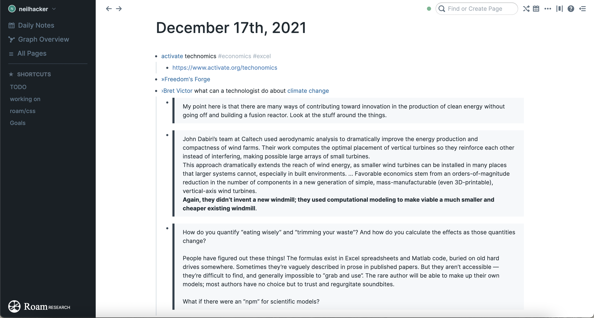
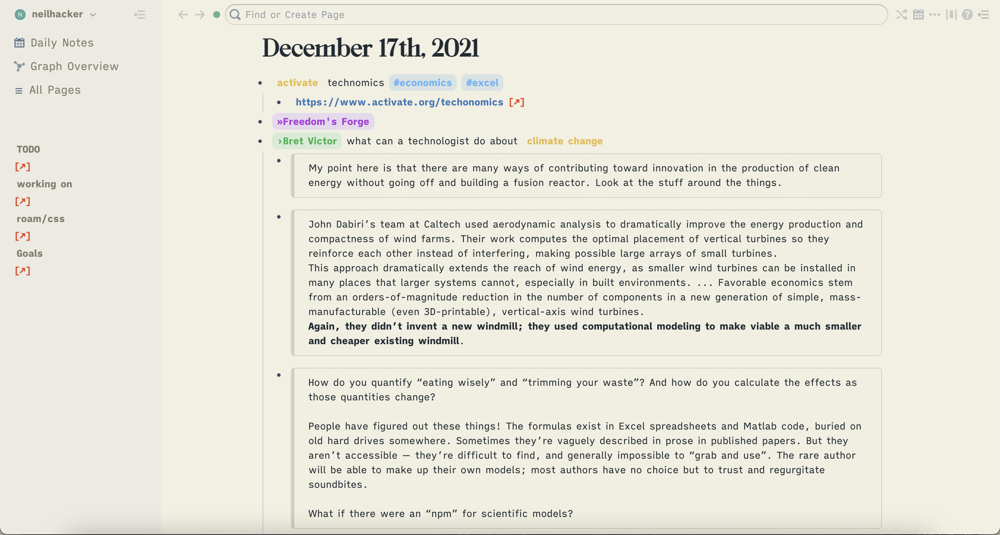

Some custom css scripts for sites to make them nicer.

### Roam
This is pretty wide ranging, mainly it changes the colour pallet, fonts, and has a host of conditional highlighting. I've used keyboard shortcuts 
to quickly get books and people to highlight differently.
* People shortcut so that [[@@John Smith]] →  [[›John Smith]] 
* Books shortcut so that [[§§some book]] → [[»some book]] 

These then trigger rules in the css file to get people to show up green and book purple.

### Google docs
Gets rid of page breaks so document looks like it is infinite page.

### Twitter
removes entire right hand side so you don't have trending news, follow suggestions etc. Also removes some icons from the left menu 
I never used. Honestly getting rid of trending news is the best upgrade to my twitter experience.

### Stylus
I use stylus for my twitter and google doc themes.
* Install stylus (https://chrome.google.com/webstore/detail/stylus/clngdbkpkpeebahjckkjfobafhncgmne)
* Under "Actions" click "write a new style"
* Paste in the css in this repo
* At the bottom of the page put the settings to "URLs starting with" and then "https://twitter.com/"
* Save 

For Roam the css is in [[roam/css]] as this makes it work on my phone as well. 
